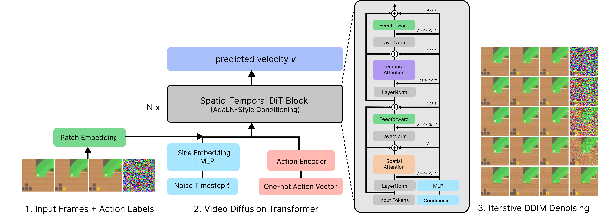

# Open-Oasis — CoinRun World Model

An action-conditioned, video-generating world model trained on the videogame [CoinRun](https://github.com/openai/coinrun) (Procgen) gameplay.
Adapted from [500M Oasis Minecraft World Model](https://oasis-model.github.io/), but scaled down to 64×64 pixel-space generation, without need of interleaved training with VAE. 

Given a single prompt frame and a sequence of actions, the model autoregressively generates future frames using DDIM diffusion, acting as a "simulator of the game world" aka World Model.

# Sample Rollouts
Videos from the largest trained 58 Model:

<video controls width="240" src="figs/episode 1777341548.mp4">Your browser does not support the video tag.</video>

# Scaling Laws

With limited compute, I scaled across 5 model sizes from 5M - 58M parameters

	
	

## Credits
- Based on [Oasis](https://oasis-model.github.io/) by Etched & decart.
- Dataset: [p-doom/coinrun-dataset](https://huggingface.co/datasets/p-doom/coinrun-dataset) on HuggingFace.
- CoinRun environment: [OpenAI Procgen](https://github.com/openai/procgen).
- Agentic Programming :) via Claude
